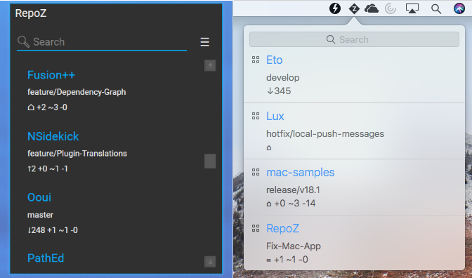

# RepoZ

RepoZ is a lightweight git repository information aggregator with Windows Explorer- & CLI-enhancements helping you keeping track of git repositories on your development machine.

🌈 [Check the Releases page](https://github.com/awaescher/RepoZ/releases) to download the latest binaries! 🌈

## The UI
RepoZ provides a quick overview of your repositories including their current branch and a short status info. Additionally, it offers some shortcuts like revealing a repository in the Windows Explorer or macOS Finder, opening a command line tool in a given repository and checking out git branches.

RepoZ is available for Windows and macOS.

## Command Line Sidekick
RepoZ is a UI-centered tool but comes with a sidekick app called **grr** to empower the command line hackers. 
With **grr**, the information from RepoZ can be brought to any command line tool.

It supports ...
 - listing all repositories found in RepoZ including their branch and status information
 - filtering for repository names (to list or jump) by regex patterns, like `grr M.*`
 - jumping directly to a repository path by adding the `cd` command, like `grr cd MyRepo`
 - opening a file explorer in a repository from anywhere in your command prompt with `grr open MyRepo`
 - list files in a repository following a pattern with `grr list MyRepo *.sln` (add `-r` for recursive search)
 - open files in a repository directly with `grr open MyRepo *.sln` (add `-e` for elevated mode, "as Admin")
 
See it in action in a ([styled](https://github.com/awaescher/PoshX)) powershell console:

See the topic **Installing grr** on how to to make use of **grr** throughout the system.

#### Don't forget to have a look at `grr help` once you get your hands on.

## Enhanced Windows Explorer Titles
As an extra goodie for Windows users, RepoZ automatically detects open File Explorer windows and adds a status appendix to their title if they are in context of a git repository.

### Installing grr
To use **grr** throughout your system like you use **git ...**, you have to add its path to the PATH variable. Currently, this has to be done by hand.

Press `Windows`-`R`, run `SystemPropertiesAdvanced.exe` and click the button "Environment variables ...". You can add the new path to the user "path variable". Don't forget to restart open command line tools to let this setting take effect.

## Credits
The **grr** app icon was made by <a href="http://www.freepik.com" title="Freepik">Freepik</a> from <a href="https://www.flaticon.com/" title="Flaticon">www.flaticon.com</a> and is licensed by <a href="http://creativecommons.org/licenses/by/3.0/" title="Creative Commons BY 3.0" target="_blank">CC 3.0 BY</a>
